<!-- TOC -->

* [**J's DnD Seshes**](#js-dnd-seshes)
    * [<u>**Characters**</u>](#ucharactersu)
        * [Player Characters](#player-characters)
            * [*Jessy (and parents)*](#jessy-and-parents)
            * [*Pip*](#pip)
            * [*Renfri*](#renfri)
            * [*Lia*](#lia)
        * [NPC](#npc)
            * [*Inara*](#inara)
            * [*Joshua*](#joshua)
            * [*Akra*](#akra)
            * [*Lilli Nim*](#lilli-nim)
            * [*Arthur White*](#arthur-white)
            * [*Merlin Mitheralfist*](#merlin-mitheralfist)
            * [*Kribi Mirlon*](#kribi-mirlon)
            * [*Baku (but with glasses)*](#baku-but-with-glasses)
    * [<u>**Summaries**</u>](#usummariesu)
        * [Session 1](#session-1)
            * [Song](#song)
        * [Session 2](#session-2)
            * [Song](#song-1)
        * [Session 3](#session-3)
        * [Session 4](#session-4)
        * [Session 5](#session-5)
        * [Session 6](#session-6)
        * [Session 7](#session-7)
        * [Session 7.5 - The Dancing Horse Mini-Chapter.](#session-75---the-dancing-horse-mini-chapter)

<!-- TOC -->

# **J's DnD Seshes**

## <u>**Characters**</u>

### Player Characters

#### *Jessy (and parents)*

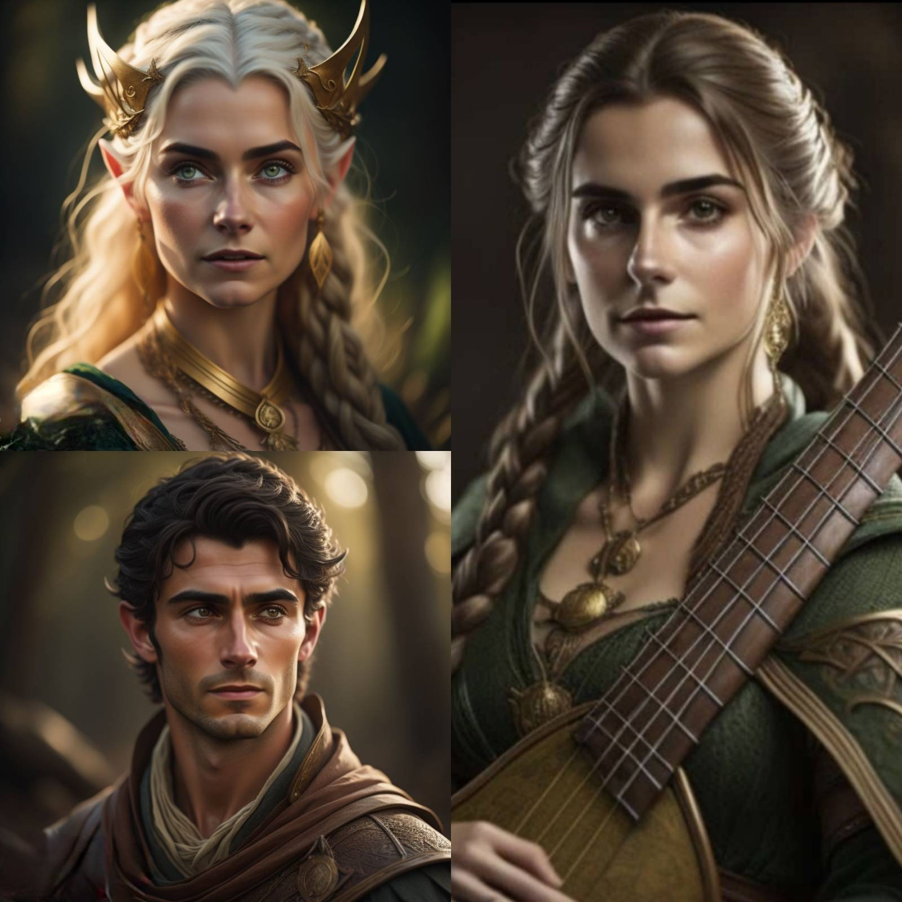
  

#### *Pip*

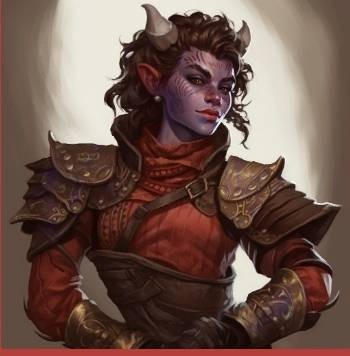
  

#### *Renfri*

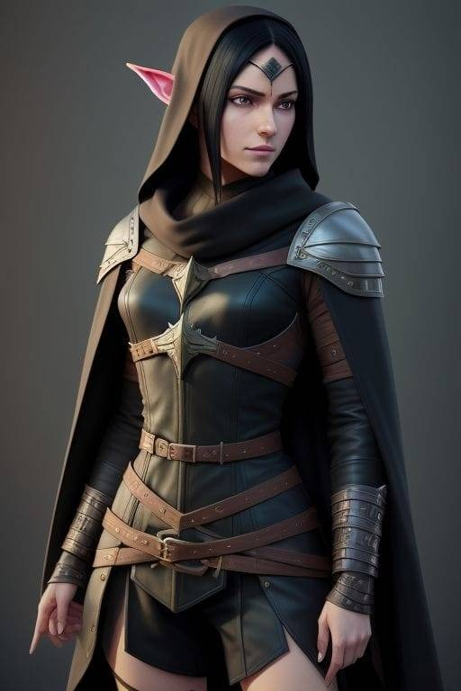
  

#### *Lia*

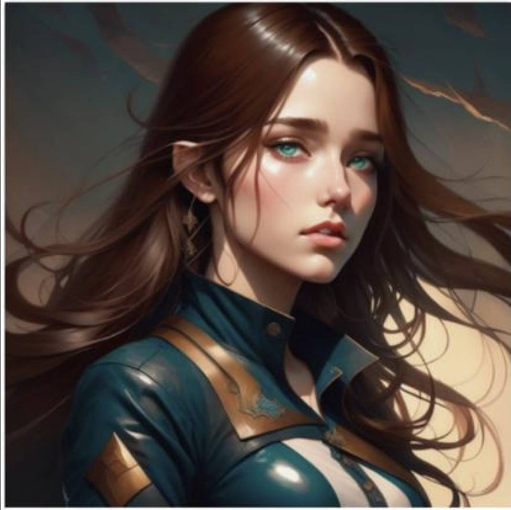
  

### NPC

#### *Inara*

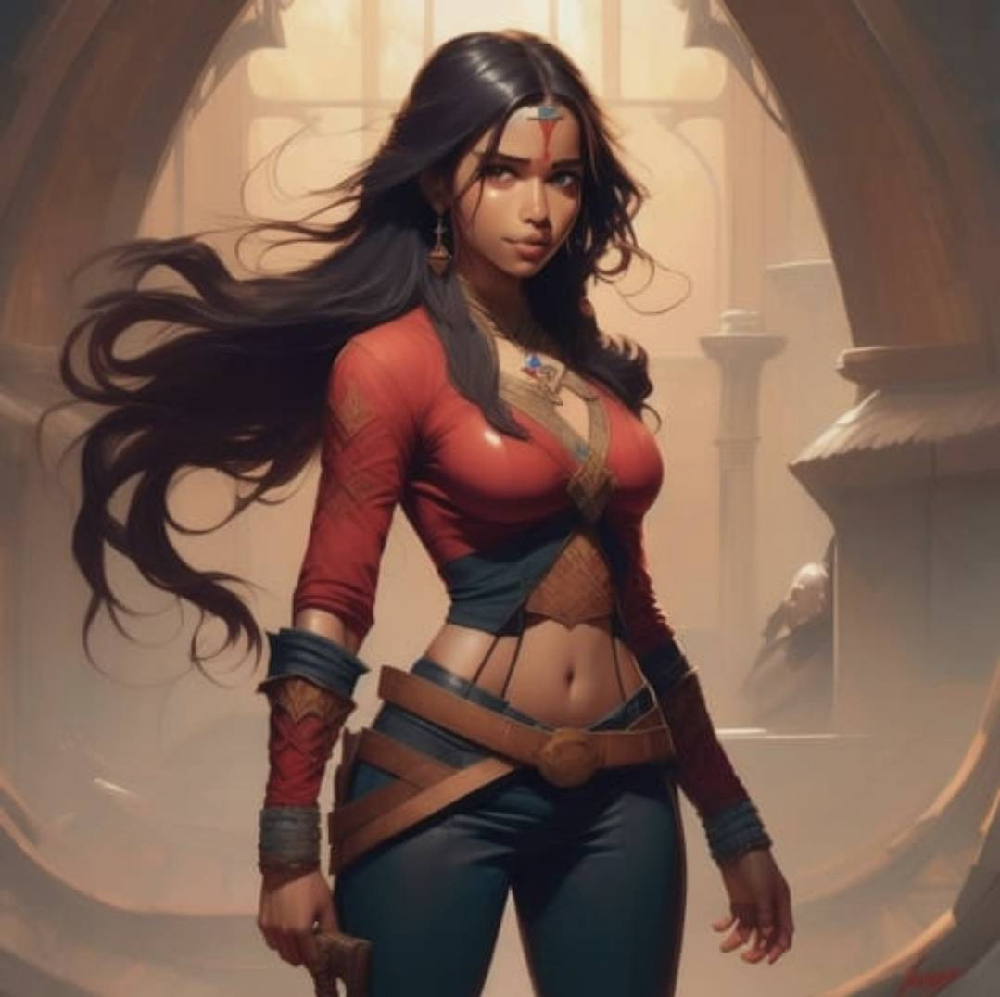
  

#### *Joshua*

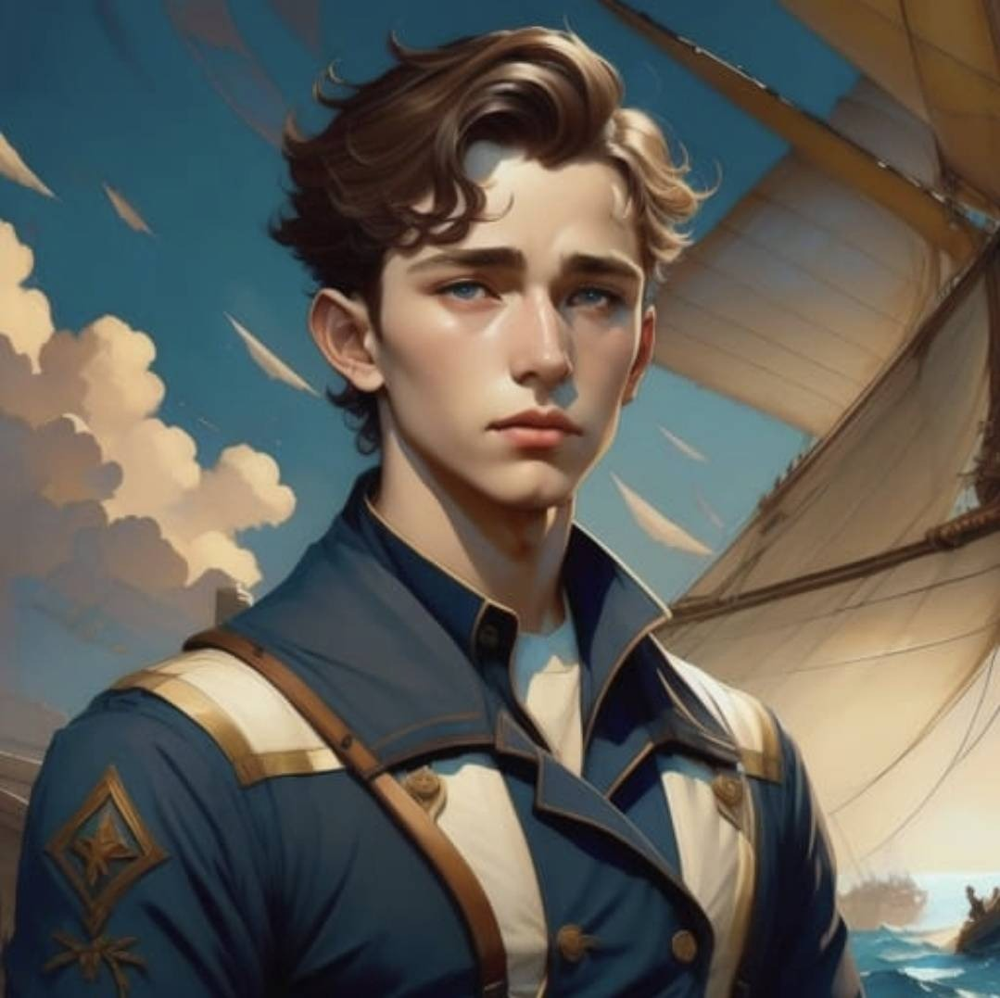
  

#### *Akra*

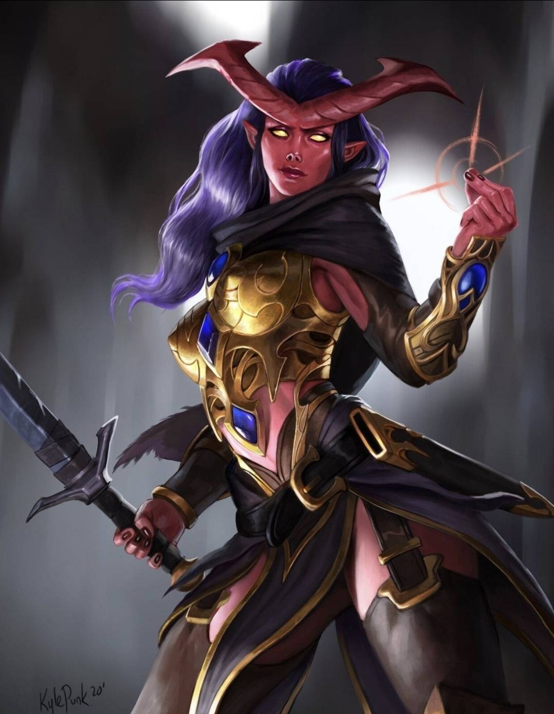
  

#### *Lilli Nim*

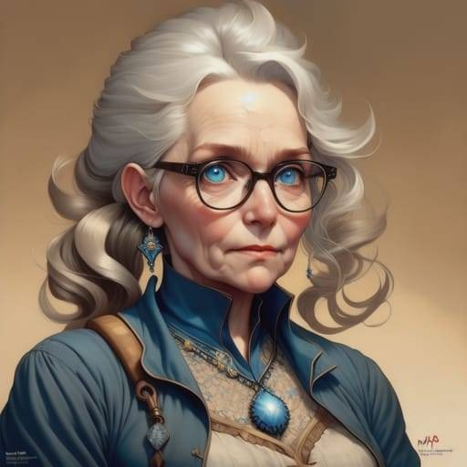
  

#### *Arthur White*

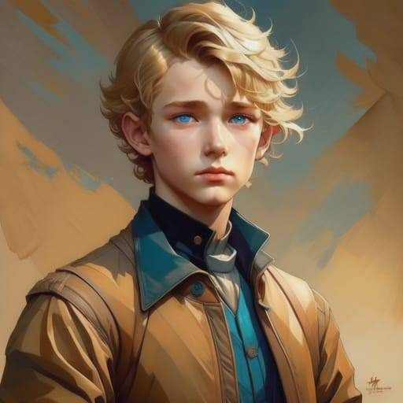
  

#### *Merlin Mitheralfist*

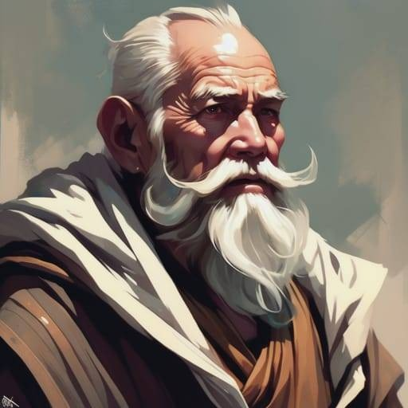
  

#### *Kribi Mirlon*

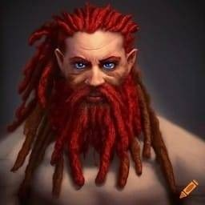
  

#### *Baku (but with glasses)*

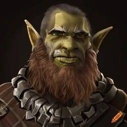
  

## <u>**Summaries**</u>

### Session 1

In the city of Mythrandir, on the continent of Terra, a
team are being assembled by Akra, a teifling fighter and leader of the Slayer's
Take (a group that procures rare things for profit). 
Jessi, posing as a human bard, is looking for adventure and inspiration 
in her songwriting.

Together with Lia, a human fighter, Pip, a teifing rogue, and Renfri a
half-elf rogue, they are tasked by Akra to retrieve basilisk fangs from
Storm Wreck Isle and collect information from a sorceress called Inara.  
After embarking on a boat with Joshua, the party is attacked by
Sahuagine. Lia manages to kill them, while Jessi sings encouragement at the
back.

The party arrives at Storm Wreck Isle and travel to the
town of Dragons Rest. 2 groups of zombies were awaiting them in the woods.
Lia and Jessi engage the zombies, whilst Renfri and Pip wander
into the trees. The fight was short, Jessi managing to enchant one zombie to
flail around in the other direction drawing the others' attention.
However, as Jessi was concentrating on the spell, her disguise slipped,
revealing her half-elven lineage, where Lia was able to perceive but kept
to herself.

The party eventually make it to town, and are on edge. There they discover a
temple that worships the dragon, Runara, and meet Inara within. Inara
gives the party information as to the basilisks' whereabouts, and
also tasks them to find out the cause of the island's zombie infestation.

Afterward, the party head to a pub to settle in for the night for much
needed rest. Jessi performs, and the party gets to know each other a
little.

#### Song

    In the land of Mythrandir, a grand adventure begins, a mission from the Slayers
    Take, one they're determined to win.
    Lia the warrior, fierce as fire within.
    Pip, the tricky tiefling rogue, quick and sly.
    Renfri, the half-elf rogue, secrets in her eye.
    
    Joined by Jessi, the bard with a melody so sweet,
    Together they set sail to a land so neat.
    Across the sea to Storm Wreck Isle they steer,
    Their hearts filled with hope, dispelling all fear.
    
    Oh, they're the Cross Swords, a band so brave,
    Facing danger head-on, their spirits never wane.
    Unyielding in their quest, they'll battle all foes,
    And in the end, they'll be hailed as heroes.
    
    Upon their voyage, the sea churns and roars,
    As they battle the Sahuaugine, those sea-dwelling horrors.
    With swords and spells, they fight side by side,
    United in purpose, their courage can't hide.
    
    Arriving at Dragons Rest, an ancient land of lore,
    Skeletons and zombies rise, an undead galore.
    But the Cross Swords stand strong, their will unshakeable,
    With their blades gleaming bright, they remain unstoppable.
    
    With hearts ablaze, they descend into the depths,
    Facing basilisks, the guardians they must best.
    Through perilous darkness, they navigate,
    Their unity and strength the darkness can't abate.
    
    Oh, they're the Cross Swords, a band so brave,
    Facing danger head-on, their spirits never wane.
    Unyielding in their quest, they'll battle all foes,
    And in the end, they'll be hailed as heroes.
    
    Emerging triumphant from the deepest abyss,
    The Cross Swords are hailed, the tale of their prowess.
    Heroes of Dragon Rest, their fame spreads wide,
    The saviors of darkness, with hearts unified.
    
    With heads held high, their victory they claim,
    Forever remembered, immortalized in name.
    Lia, Pip, Renfri, and Jessi, a fellowship true,
    The Cross Swords, a symbol of courage anew.
    
    Oh, they're the Cross Swords, a band so brave,
    Facing danger head-on, their spirits never wane.
    Unyielding in their quest, they'll battle all foes,
    And in the end, they'll be hailed as heroes.
    
    Dragons Rest sings of their valor and might,
    The Cross Swords forever shining in the light.
    Their journey may end, but their legacy remains,
    A testament to friendship, overcoming all pains.

### Session 2

The party set off from The Dragon's Rest towards the observatory to investigate
the source of the undead and to find the missing sorcerer, Jensen. Whilst
moving through the woods, Lia hears the sound of Zombies approaching. 
Three Zombies attack the party who choose to stay and fight, managing 
to defeat them. A hoard then arrives on the horizon but the party is 
saved by Runara, the Bronze Dragon who resides on Stormwreck Isle. 
Runara thanks the party for attempting to restore the natural order and 
protects them on their way to the observatory.

Once there, the party are set upon by several skeletons. Pip and Renfri take
these out by using their rogue stealth and acrobatics. The party then make
their way up the observatory tower and come across Jensen's quarters where they
find a broken mirror with Elvish inscriptions that Renfri is able to decipher.

On the top floor of the observatory, the party encounter three skeletons, a now
dead and shackled Zombie Jensen, and a mysterious hooded figure in black robes
chanting a spell in Elvish, Infernal and (what Inara later identifies as) Deep
Speech. The figure hears the party and vanishes, leaving behind a pulsating,
glowing purple orb.

The party make quick work of the skeletons and Pip and Lia
investigate the orb. Jessy, having missed all her previous attacks against the
skeletons, fires the killing blow to take out Jensen. Both Lia and Jessy work
together to destroy the orb and the spell over the Isle is broken. The party
retires to Jensen's old quarters in the observatory tower and Renfri discovers
his diary in a hidden drawer.

#### Song

    (Verse 1)
    In a land full of darkness, where shadows do roam,
    There's a hero, they say, but I don't feel at home.
    I've fought many battles, with creatures of the night,
    But when it comes to skeletons, I just can't get it right.
    
    (Pre-Chorus)
    My sword swings wide, but it always goes astray,
    Those bony foes, they taunt me with decay.
    But when the horde of zombies come crawling through,
    I rise up with courage, knowing just what to do.
    
    (Chorus)
    I'm rubbish at killing skeletons, that's for sure,
    But I'm a master when it comes to zombies, I endure.
    With every swing and every strike, I'll face the undead,
    And I'll emerge victorious, that's where my strength is spread.
    
    (Verse 2)
    Those skeleton warriors, they dance with such grace,
    Dodging my attacks, always one step ahead of my pace.
    Their bones rattle and clatter, mocking my skill,
    But I'll keep on fighting, determined to fulfill.
    
    (Pre-Chorus)
    My aim may be off, my arrows miss their marks,
    But when the zombie horde surrounds me in the dark,
    I'll unleash my might, with an unyielding zeal,
    Their bodies will crumble, my prowess will reveal.
    
    (Chorus)
    I'm rubbish at killing skeletons, that's for sure,
    But I'm a master when it comes to zombies, I endure.
    With every swing and every strike, I'll face the undead,
    And I'll emerge victorious, that's where my strength is spread.
    
    (Bridge)
    The skeletons may sneer and laugh in their decay,
    But I'll prove them wrong, I'll find a better way.
    I'll train and grow stronger, honing my attack,
    Until the day I conquer, and their bones shall crack.
    
    (Chorus)
    I'm rubbish at killing skeletons, that's for sure,
    But I'm a master when it comes to zombies, I endure.
    With every swing and every strike, I'll face the undead,
    And I'll emerge victorious, that's where my strength is spread.

### Session 3

The party stay the night in Jensen's quarters in the observatory. They eat 
food and read the pages of Jensen's diary, revealing a member
of the council of Mythrandir has been visiting the island. 

In the morning, they ask Inara about the potions which she identifies to
be the Good Hope, Haste and Sanctuary potions. When asked about the
council member, she says she has an idea but doesn't reveal anything until
Renfri presses her for more information later on. She then reveals to
Renfri that she is suspicious of Vespera Shadowmire, her old mentor, who
she knows has been leaving on various research missions. She vows to
confront her on her return to Mythrandir.

The party enter the caves under the observatory and battle two
basilisks, working together using the shards of Jensen's mirror to defeat
them with ease. Pip and Renfri deal the final blows.
On exiting the caves, Jessy's true identity is revealed: she is in fact a
half-elf, not a human and is 92 years old. Whilst Pip and Lia are
forgiving of Jessy, Renfri keeps her distance. The
party returns to the celebrating town of Dragon's Rest and are given free
drinks by the bartender, Greg, who asks them what they call themselves. At the
moment: The Cross Swords.

### Session 4

The Cross Swords are awoken by the sound of bells and witnesses the town of 
Dragon's Rest reburying their dead and mourning the loss of Jensen. The 
party waits for Inara in the library and return as a group to Mythrandir 
where they receive their bounty. Inara gives them a map of the city and 
says she will be back in touch. 

The party explore the city. They first enter The Crimson Sash clothing
store and meet an elderly gnome called Lilli Nim who repairs their tattered
clothes and designs their outfits with the Cross Swords symbol. The party then
split up to explore further.

Renfri, with the goal to steal from the rich, tries to enter the Inner
Sanctum through the main gate, but it is guarded. Instead, she enters the
Temple of Bahamut, though decides that this is not the place
to steal and joins Lia in the Magic Shop, Jinx and Trinkets.

Lia, with the goal to improve her magic abilities, meets Kribi Mirlon, the
Magic Shop owner, who creates a perception potion for her. Both go to join
Pip and Jessy at the weapons shop: Tintagel Weapon Shop. Pip and Jessy meet
Merlin and his apprentice Arthur and receive new weapons and upgrades to
their armour. Renfri also receives an upgrade when she arrives. The party
then go to The Green Dragon pub where Jessy performs for the crowd. Pip
notices the symbol of The Swallow Thieves Guild and enters the secret
underground lair where she encounters an old friend of her father, the
leader of The Swallows, a half-orc named Baku. Armed with new illicit
trinkets, she returns to the group and a very suspicious Renfri. T

The party rest for the night and return to The Slayer's Take where there is
a notice from the local farmer asking for help to kill an Ankheg in
exchange for 10 Gold and a horse and cart. Akra approaches Jessy and
reveals that a high level political client has offered a large amount of money
for the theft of the silver dragon egg in the study of Soros Davino, the leader
of the Myrandir Council.

### Session 5

The Cross Swords organised their outfits with Lilli Nim and returned to The 
Slayer's Take where Akra asked them for a rundown of their plan to enter 
the mansion. Inara called via the earring and said she was going to 
confront Vespera Shadowmire at the party and that she had a +1 ticket. 
Renfri took the ticket and organised to attend with Inara. Pip and Lia 
decided to take the 2 tickets provided by Akra's client and pretend to be 
nobles from Klegas. Jessy met with her rival, Adran Amastacia, the lead 
singer of The Fleetwood Trio, and bargained her way into joining the band 
who had been booked as entertainment.

On arriving at the mansion, Pip and Lia bumped into Kribi who revealed he was a
member of the council and the three of them had many drinks. Renfri was
introduced to Soros Davino (the leader of the council) and Lyslyl Strongsong (a
paladin from the Temple of Bahamut and member of the council). Everyone was
gathered in the dining room where Soros gave a speech about the nations coming
together in peace. During the meal, the party met Vespera Shadowmire who was
wearing a necklace that Renfri recognised immediately. She remarked to Jessy "
Is that the name you are going by nowadays?" She then told Pip and Lia that she
has some upcoming business near Klegas but was unsure if she would make The
Festival of the Hunt.

After dinner she excused herself and left quickly, followed swiftly by
Inara. Whilst the party scouted the mansion, Renfri hears the word "Ren-"
before silence. She rushed to the main door and asked the guards what had
happened. They were unresponsive and clearly under a spell.
Renfri called for Jessy who was able to break the spell and the guards revealed
that Vespera and Inara had argued before Vespera had grabbed Inara saying "I
need another sorcerer now anyway" and both had disappeared.

Whilst Jessy went to break the news of Inara's kidnap to the council, Pip
managed to scale the building and land on the upper balconies revealing two
small bedrooms and a master bedroom. The doors were sealed with magic and
she couldn't get in. Lia overheard Soros saying that the room was secure as
the guards had the keys and swiped a set of keys from an unsuspecting guard
which she handed to Renfri. On the second floor, Lia and Renfri managed to
trick a guard into following them into Inara's guest room where they locked
him in. Lia then distracted the final guard by trying to flirt with him
whilst Renfri snuck up onto the top floor. There she encountered a sleeping
Hellhound and struggled to put the keys in the lock. This woke the
hellhound. Renfri managed to get through the door and over to the balcony
to open the window for Pip as the Hellhound attacked. She sent a signal to
the team for help. Hearing this Jessy joined Lia on the second floor and
charmed the final guard who let them past. Pip was able to talk to the
Hellhound using Infernal and was able to encourage it out onto the balcony. Lia
picked up a lamp from outside the room and the party was able to use this to
solve the mirror riddle.

Once inside the study they came across a Gargoyle who asked a riddle. Lia
was able to remember the speech Soros had given at dinner and gave the
answer: Footsteps. The Gargoyle released the Silver Dragon Egg and
Pip and Lia managed to carry it outside. Renfri and Pip made graceful landings
when jumping off the balcony, Lia did not. The egg made it safely. Jessy
returned to the band. Pip retrieved Inara's carriage and took Lia and Renfri
back to The Slayer's Take where Akra stored the egg in a secret room under the
floorboards. The Fleetwood Trio then burst into The Slayer's Take to reveal
that Jessy's charm had worn off the guard and that she had been arrested.

### Session 6

On finding out Jessy had been arrested, Akra told the party to get rid of
Inara's carriage and find somewhere to hide till the exchange for the dragon
egg had been made. Pip got rid of the carriage outside the city and was able to
sneak back in to meet Renfri and Lia at the local tavern. Pip took the pair
into the Swallow's Den where they met Pip's uncle Baku who let them rest the
night and sent his Swallows out to find out where Jessy was being kept. He also
gave Pip a cloak of Elvenkind as a gift. Baku recognised Lia's last name, 
Strongbrooke, and revealed that he knows her father well and is currently 
doing business with her brother. The party make a plan and one of Baku's 
Swallows, a gnome named Baldur, dimension doored them into a cupboard in 
the council.

During this time, Jessy was making music in her cell with a halfling named
Bolger who was in for not paying his taxes. She sent a message to the party
saying that she had been arrested and gave a rough location of the cell she was
in. Lia attempted to draw the guards away from the servant quarter doors by
causing a distraction, but it didn't work. Pip put on a janitor's outfit and
convinced the guard that she was finishing up the back shift. The guard
followed Pip into the servant quarters whilst Lia stayed hidden in the main
hall and Renfri kept watch from the cupboard. Inside the servant quarters, Pip
watched two guards exit the staircase guarded by a gargoyle and saw two other
guards replace them using the password "sandstone". Pip then knocked out the
guard watching her and used the password to sneak downstairs.

At this point Lia snuck into the room and was able to send a message to Pip
to get the password. Lia and Pip made their way through the underground
jail and passed a cell which had a gnome inside called Nom who asked to be
released. Pip agreed to release him if he would help save Jessy. Nom agreed.
Jessy's cell was guarded by the two guards from the changeover and a
hellhound. Pip pushed Nom forward who struck the hellhound with blue
lighting magic and it chased him back towards the exit. Pip and Lia
attacked the guards with the aid of Jessy who managed to steal keys off the
distracted guards. Once free, Jessy offered freedom to Bolger who refused.

Reunited, Jessy, Lia and Pip made their way back to the exit and came
across Nom who was laughing hysterically and ripping apart the hellhound
with his hands. They all retreated back up to the servant's quarters.
Meanwhile, from her vantage point Renfri watched as Soros entered the council
main hall with an older woman dressed in green robes laced with bronze. She had
a tiara-like headpiece embedded with emeralds and made of bronze with two
pieces that went up like horns. She turned to the cupboard asked Renfri to come
out. Renfri informs Baku through the dimension door that they may be
compromised, and he closes the portal.

Renfri exits and discovers the woman is Runara, the bronze dragon from
Stormwreck Isle, in human form. Nom peaks out the door of the servant
quarters, sees Soros and Runara and disappears immediately. Runara calls
the party out and they all reunite. She brings news that a hoard of undead
have been seen around the Metal Mines, south from the city of Klegas. She
enlists the party's aid and Soros agrees to this saying that if they solve
this they will be absolved of their crimes. He also asks for the return of
the silver dragon egg. The party, now free and with a mission for the
council and Runara, return to The Slayer's Take where Akra gives them their
earnings from the dragon egg heist and a map of the continent.

The party undertake a mission from The Hunt Board in The Slayer's Take and
help farmer Bran Brightwood kill an Ankheg that has been terrorising his
sheep. In exchange for their help he gives them 10 gold and the use of a
horse and cart. The party choose Beauty, a black gypsy cob with a speck of
white on her forehead who seems calm and friendly. As part of the deal they
have to take her son, a pony yet to be named. The party look forward to
pimping their cart as their journey continues.

### Session 7

The Cross Swords prepares to set out for Klegas. All four head to Jinx & 
Trinkets Magic Shop where they encounter Kribi who is aware of the mission 
set by Runara and Soros. He gives Lia an everburning torch and Renfri a 
fireball scroll. He agrees to look out for any protective armour and if he 
finds some he will deliver it on to Klegas. Renfri and Jessy then head to 
the Raven's Tower Library where they encounter Corrin, an elderly halfing 
and friend of Inara. Hearing that they are en route to rescue Inara, he 
gives them a book of necromancy and the undead. Jessy buys a book on 
monsters of the plains and Renfri borrows a book about the Elven families 
in the Kingdom of Elgarest. Renfri also borrows a book on Deep Speech in an 
attempt to learn it and decipher the spellbook which Corrin reveals to be 
Vespera Shadowmire's spellbook. 

Lia and Pip head to Tintagel Weapon Shop and ask Merlin for some upgrades.
He reinforces Lia's scimitar, gives Pip 30 lighting darts and banes
Pip's dagger against the undead. Renfri and Jessy arrive and have their daggers
baned against the undead too. Before leaving, Renfri finds Baku and sells him 5
tomes that she stole from Corrin's library.

The party leave Mythrandir and set off on the long journey to Klegas.
During the journey, Renfri reads the Deep Speech book and gains some
insight into the language. Pip and Jessy read the book of the undead and
become very familiar with the creatures in it. They also read a couple of
pages on the monsters of the plains. The first night passes with no issue.
On the second night, the party discover that their things have
been rummaged through. Nothing has been taken, but items have been moved.

On the third day, the party are attacked by a group of goblins on wargs.
The party put up a good fight with Lia and Renfri managing to take some out,
scaring off the remaining rider and warg. Pip gets knocked unconscious but
is revived by Jessy. Pip then speaks to the remaining warg and encourages
it to flee. The party continue on and encounter no more monsters. On the
fifth night, they hear elves singing in the woods. They are mourning the
20-year anniversary of the death of King Eladithas who has been succeeded by
his son King Sylmenor. The next day, the party follow Renfri to a secluded
part of the forest edge where they follow a river to the small village of
Nowhere.

### Session 7.5 - The Dancing Horse Mini-Chapter.

The Crossed Swords arrived in Nowhere. Renfri excused herself saying that 
there was someone she needed to check in on and that the party should 
explore the village for a bit. Pip went into the market and brought apples 
back for the horses. She tried learning how to juggle and taught Beauty and 
Blitz to approach her on command and taught Beauty how to ride in a circle 
with her standing on her back. Along with Jessy, they devised a spectacular 
performance for the village.

Lia took Blitz into the market to have a look around. Suddenly everyone's
attention is drawn to the bridge where Pip and Jessy ride up the market street.
Jessy falls into the fountain in the village square whilst Pip rides beauty
around it. They dazzle the crowd earning 123 copper coins which Lia collects.
Lia and Blitz start hyping up the crowd and Pip and Jessy perform another
routine to more rapturous applause, earning 86 more copper. Kids in the village
pet the horses and follow them back to the field.

Lia, Pip and Jessy go into the tavern to spend their copper, drink mead and
play two truths, one lie. Jessy: I am blond (lie), I can play all
instruments (true - badly), I slept with Adran (true). Lia - I am a trained
hairdresser (true), I have some skill in mechanics (true), I partake in my
dad's dodgy business (lie). Pip - I do not have blue skin (lie), my family
are all tatoo artists (true), I have a brother who is kinda like a dog
(true). They notice that the town is mainly made up of humans though there
are 3 half-elves keeping to themselves at the back of the tavern. When they
ask the barman about this he reveals that there has been tensions between
the elves and people in the village. He says he can't stand elven kind and
preferred the music of the group's performance to the singing of
the elves the previous night. Pip, Lia and Jessy start to feel very
uncomfortable and take their mead to go.

Back at the cart, Jessy and Lia read. Jessy learns more about uncommon
undead, including Liths, and Lia learns about the monsters of the plains.
Pip starts drawing the party's adventures so far on the cart. She also
notices that a few scales on her armour have been moved. Jessy uses the
spell Detect Magic to try to see if there is someone there. The spell only
picks up the magical aura on Pip's cloak of Elvenkind and Jessy's necklace.
This is news to Jessy. Jessy sends Renfri a magical scroll to say they are
chilling at the cart and will wait for her to return.

### Session 8

Whilst Pip, Jessy and Lia cause chaos in Nowhere, Renfri reunites with Old Man
Lutz who is overjoyed to see her. He gives her food and asks about her travels
and her new friends. After a small catch up and a cup of tea, Renfri rejoins
the team who ask about the village and the animosity they felt from several
villagers. 

Renfri responds that the village is a bit of a shithole. She then
brings Lutz down to join the party, and they all have dinner. Lutz tells them
about the village's past where elves from the Kingdom of Elgarest took over the
village during the war. Many people lost their lives and families were torn
apart. Once the war was over, the elves abandoned the village and went back
into the forest but did not leave any protections for the village. This has
caused tensions for the next generations who still hold on to this hate for the
elves. Old Man Lutz hopes one day to see peace restored between the elves and
the villagers.

After dinner, Renfri takes Old Man Lutz back home. He gives her
a poster which had been handed to him by some elves the week before. She puts
it into her pocket. He then tells her that someone is following her group. He
does not know the intentions of the being, only that they are being followed.
After he says this, he begins to shake, his eyes roll back and turn a bright
blue. He speaks in an ethereal voice: "Crown. Fire. Family. Death. Keep them
close." Renfri rejoins the party, tells then what Old Man Lutz said in his
trance, and they set off for Kleopas.

The party continue to read their books. Lia begins to teach the party some
fighter skills. During the journey, the party throw stones in an attempt to
reveal who is following them. They hit someone who shouts and throws a
stone back. Jessy and Renfri give chase but the invisible creature
disappears. Jessy recognises the magic trace as Nom, the gnome that Pip
released from the Mythrandir prison.

When the party arrive in Klegas, there is bunting and food stalls
everywhere in preparation for The Festival of the Hunt. Lia had been last
year's winner and had won a substantial amount of money. They go to Lia's
mum, Maria's, hairdressers and are given food and tea. Maria is delighted to
see her daughter though surprised she is back in Klegas so soon. After
catching up for a bit Maria encourages the party to sign up for the
festival. Lia's dad Martin is out on business securing prizes but
will hopefully be back in time for dinner. Lia's brother Mark is apparently
doing business with a man named Baku in Mythrandir. She invites the entire
party to join the family for dinner that evening and encourages them to explore
the town. Pip goes to the Tiefling District and explores a glassblowers shop,
aiding Renfri in stealing a couple of items.

Jessy and Lia go to the local magic shop. The owner reveals that Jessy's
necklace is an heirloom of the Elven Kingdom of Elgarest. The owner also
gives Lia some free items. When they ask about Nom and explain he is
following them, the magic owner rushes them out if the shop saying that Nom
is a powerful, fearsome being that he does not want to cross. Renfri then
goes to an old couple's house who nurture and sell animals. She meets a
black Raven who is keen to go on an adventure and spread his wings.
He settles on Renfri's shoulder. Renfri hears the sound of animalistic
laughing...

### Session 9

Renfri informs Pip of the strange sound she heard but Pip doesn't recognise it.
The two meet up with Lia and Jessy at The Armoury in the Dwarven Quater run by
Darin, an elderly skilled dwarf. Lia buys chain mail and Jessy buys scale mail
in preparation for the Festival of the Hunt. Jessy is very nervous about the
competiton and asks if she might die. Lia assures her that she won't die. They
head towards The Fighting Pit in the centre of the city and approach Krusk, a
middle aged half-orc with massive muscles and scarring. He has seen many fights
and is the organiser of The Hunt. He is overjoyed that Lia is going to take
part in this year's festival and signs them all up. They decide on the prize
they wish to win if they are victorious. Lia opts for the weapon reward, Jessy
for the magical item reward and Renfri and Pip choose a boon reward. The party
return to Lia's house for a delicious homecooked meal and dessert and meet
Martin, Lia's dad who is delighted that his daughter is home and entering the
festival. After dinner, Lia teaches the party some fighting skills and they
rest up ready for the competition. At 10am the next morning, the fighters are
in position. Jessy is in the halfling quater with a strange half-elf, later
revealed to be Beiro, one of Pip's brothers. Renfri is in the gnome quarter
with the hyena-like being she had heard earlier and a half-orc. These are
Grunt (a knoll) and Feng, Pip's other two brothers. Lia is in the human quarter
with an older, slightly rugged dwarf who is later revealed to be Vondal, an
uncle-like figure to Pip. Pip is in the tiefling quarter with a number of local
Klegas combatants. Krusk stands atop The Fighting Pit in the VIP box with
Martin Strongbrooke to his left and a fierce half-orc to his right. This is
Thokk, Pip's father. The battles begin. Pip, Lia and Renfri easily take out a
couple of monsters in their areas. Feng and Grunt take out quite a few as well.
Jessy struggles with her fight against the first monster but eventually kills
it. This awakens a tree which attacks her and Beiro. Renfri and Pip use their
rogue sneak attacks to do severe damage against the monsters and rack up
points. Lia uses her action surge to land an extra blow on her final area
monster raising her point total. Martin and Thokk cheer loudly for their
daughters from their viewpoint. With the help of Beiro, Jessy manages to land
the final blow killing the tree and boosting her points. All the combatants
make their way to The Fighting Pit where they face off against a manticore.
This mythical beast is tough. Pip jumps on its back, stabbing it. Lia and
Renfri run up and land several damaging blows. Pip is flung off the beast.
Jessy inspires herself and Pip from the side of the arena. The members of The
Rat Pack all take turns attacking the beast and do some damage. The manicore
hits back ferociously. After several big hits from Pip and Renfri, the
manticore attempts to flee and takes to the skies. Lia attempts to bring it
down but the arrow just misses. Jessy pulls out her shortbow and, using her
inspiration, fires an arrow which takes down the beast. This kill gives her an
additional 15 points and secures her the win. She receives the magical item
reward: a pair of winged boots.

#### DM's comments

The fight was very close. Pip brought the manticore's health down to quite low.
Renfri would have won if she had landed both blows. Her second blow took 
its HP down to 5 which was why it tried to fly away.
Lia would have won if she had hit it with her long bow.
If Jessy hadn't used her inspiration dice, she would have missed and Pip 
would have had a shot at the win.
Genuinely, it was so bloody close, it was insane. Jessy's attack was a 12 
to hit but the armour class was 14 and the inspiration die rolled a 2. So 
you just managed to hit it and got the win.
It was a crazy competition and anyone's game at the end. I genuinely had no 
idea who was going to win.
Well played!

### Session 10

Jessy is crowned the winner of the Festival of the Hunt and is awarded the
winged boots. Krusk invites all the participants to a large feast in the
Fighting Pit that evening and encourages then to enjoy the rest of the festival
in the town. Thokk and Martin both fuss over their daughters, saying how proud
they are of them and their efforts in the festival. Pip then challenges Thokk
to a one-on-one fight to showcase her skills. He defeats her fairly easily (she
had of course, just been battling several creatures!). The whole party join The
Rat Pack and Martin for drinks in the Half-Orc Quarter's local pub where Renfri
and Feng get absolutely wasted. Renfri starts to tell Feng about their
adventures in Stormwreck Isle and the undead they fought. On hearing this,
Thokk and Martin begin whispering which Lia picks up on. On the way back to The
Fighting Pit, Martin pulls Lia aside and asks her to tell him more about
Stormwreck Isle. He reveals that The Rat Pack and several other fighters are
leading an assault on The Metal Mines in the morning as hoards of undead have
been spotted coming out of the mines. The mine boss has also been missing for a
couple of weeks. Many are afraid that Klegas will soon be under attack. Pip
eavesdrops on Thokk and Vondal discussing the morning assault and how Vespera
Shadowmire may be involved after hearing Renfri's drunken ramblings. On
arriving at The Fighting Pit, the party hear the familiar notes of the
Fleetwood Trio. They talk to Maria who reveals that Vespera Shadowmire is one
of her clients. She is part of a noble family with connections to the Elven
King of Elgarest but reveals that she was poorly treated and abused by her
father growing up. This was part of the reason why she had joined the council,
in order to help those trapped in abusive circumstances. Maria also notes that
Vespera has seemed distant and strange in recent appointments. The feast begins
and Thokk presents Jessy as Champion of the Hunt. Jessy gives a quick speech to
raucous applause. The party then retire for the evening and discuss what they
are going to do. In the morning, the party walks through a quiet Klegas and out
the southern gates. There are guards and fighters preparing themselves for
battle. Adran calls out to Jessy and reveals that the Fleetwood Trio are going
to help the city guard protect Klegas from an assault on its walls. After a
slightly awkward conversation, Jessy parts feeling inspired. The party overtake
the fighters and, following Lia's directions, arrive at The Metal Mines where
they see a hoard of zombies and skeletons in the basin area in front of the
mines. Jessy uses her winged boots to get a better view. They hear a loud
scraping sound and a skeleton minotaur appears above the entrance to the mine
and roars loudly. A ghast exits the mine entrance, sees Jessy and says "
Welcome" then bids the hoard of undead to advance and they begin moving 
towards
our party and towards Klegas.

### Session 11

The hoard continues to move towards Klegas and the ghast goes back into the 
mines. The party spring into action. Renfri and Pip use their rogue skills 
to sneak towards the mines whilst the fighters from Klegas begin their 
attack on the hoard. Jessy keeps to the skies and manages to land, 
undetected, at the mine entrance. Lia begins her assault on the skeletons 
and zombies, firing arrows from a vantage point. The skeleton minotaur 
notices Pip and Renfri approaching and encourages them to attack him. Renfri
Pip and Jessy begin their assault on the minotaur. Jessy notices a strange 
pattern of dust in the distance from where they came. Lia is pinned back by 
skeletons and can't move from her position. The skeleton minotaur brings 
its great axe down onto Jessy, almost killing her. She manages to move away 
and heal herself. Renfri gives her a potion. 
At this point, the sound of an engine is heard and an armoured vehicle 
smashes through the hoard. Martin Strongbrooke behind the wheel shouts out 
"Now!" and The Rat Pack burst out and begin attacking the hoard. 

Thokk rushes to help Pip. Martin asks where Lia is and immediately swings 
the car round to pick her up. The attack on the minotaur continues. Martin 
brings Lia through the hoard to the front of the mines. Together, the party 
defeats the minotaur with Pip landing the final blow causing bones dust to 
fly everywhere. The Rat Pack and Martin stay outside to fight off the hoard 
whilst the party enter the mines. They defeat the remaining zombies and 
skeletons inside and Lia finds a chest filled with jewels. 

Renfri finds a skeleton horse still attached to its mining cart and mercy 
 kills it. The party come across a well which Pip and Renfri investigate. 
When they move a cart blocking the exit, walls close up at the exits and 
the room suddenly starts filling with water. They move the cart back to its 
original position and climb over it instead. On the 2nd floor, they find a 
laboratory where Renfri finds a diamond. Pip searches the barracks. "Is that 
a chest?" No, it was a wall. 

Renfri sneaks around the corner and notices the ghast blocking the door with 
two ghouls. The party decide to go for a sneak attack and manage to take 
them out surprisingly easily. They use the lift to head down into the 3rd 
and final floor. On the final floor, Pip finds a chest with jewels and 
Renfri looks around the corner leading to the mine boss's office. She sees 
a figure, somewhere between life and death, furiously scribbling on paper 
and muttering to himself.

### Session 12

The party draw out the wight whilst Pip sneaks behind him. They attack him 
and are able to defeat him quite quickly. Pip gathers his notes on the 
various jewels in the mine, their location and what they are worth. The 
wight had some gold on his person and a locket with photo of a man, a woman 
and a young girl inside it. 

The party head down the carved out corridor with stone pillars. Renfri 
reads the writing on the wall, and it appears to be a temple dedicated to 
the God of Necromancy, Velsharoon. They approach a chamber with a door on 
one side and 4 dragon statues in each corner. Renfri identifies the door as 
being trapped. The party retreat to the corridor and Lia throws a rock at 
the door handle which triggers the trap. Spears shoot out into the empty 
space and the door opens. 

The party descend into the darkness and come across a large underground 
chamber with four carved pillars in each corner. The pillars are glowing 
blue and Renfri reads the carvings which discuss the resurrection of 
Velsharoon. At the end of the chamber they see stairs leading to an altar. 
Inara is chained on one side of the alter. Vespera stands holding her hands 
aloft. The silver dragon egg is in front of her, and she is wearing Renfri's 
necklace which is glowing red. 

Vespera's skin is grey and her eyes are fairly lifeless. She is slowly 
becoming a lich. Renfri and Pip begin sneaking forward and Renfri sends a 
message to Inara that they are here to help. Vespera continues the ritual 
until Renfri shoots her necklace away, and it lands on the other side of the 
altar. Jessy flies up and takes it. Vespera follows immediately and a battle 
ensues. Renfri releases Inara who helps the party. Pip secures the dragon 
egg. Lia rushes up to Verspera and she and Jessy engage in close combat.

Vespera uses her lich abilities and her lair's magic to inflict heavy damage 
on the party, bringing three of them into the red zone. Jessy attempts to 
flee with the necklace and fires an arrow straight through Vespera's head. 
Seconds before being shot, her skin returns to its normal hue, her eyes 
widen, and she says "Renfri, I'm sorry". Jessy uses her talk to the dead 
spell to ask Vespera some questions. The party panics and asks questions 
that don't really give any insight other than Vespera is connected to 
Renfri in some way. 

The party leave the mines and Inara uses her magic to collapse the tunnel 
behind them, leaving Vespera's body and the temple of Velsharoon in ruins. 
The party make their way to the mine entrance and hear the voices of The 
Rat Pack and Martin Strongbrooke.

### Session 13

The party reunite with Martin Strongbrooke and The Rat Pack at the mine
entrance. Inara checks the dragon egg and the necklace to ensure Vespera's 
spell is not lingering on them. They are clear, but she does note that 
Renfri's necklace has a curse on it. The party return to Klegas where Adran 
asks if Jessy wants to go for a drink. She agrees. Maria pulls Lia aside 
and shows her Jessy's wanted poster. She informs Lia that high elves have 
been seen in Klegas and that she can help get them out. 

Wanting to leave quickly, Renfri reluctantly sends Rook to retrieve Jessy. 
He poops on Adran who has to clean himself off and Jessy leaves a note for 
him saying "Raincheck". When reunited with the party, Jessy uses her magic 
to alter self. Pip and The Rat Pack have an emotional goodbye, and they vow 
to distract as many high elves as possible in the city. Martin and Maria 
meet the party at the farm, give them supplies and see them off. The 
Strongbrookes ask Lia to look for her brother Mark when back in Mythrandir 
as he was doing business with Baku, and they haven't heard from him in 2 weeks. 

En route to Nowhere, the party encounter a merchant who says he has tricked 
some villagers in Aerith by giving them false supplies, and now they are 
chasing him. He offers the party some of his takings if they redirect the 
mob. The party agrees and take his supplies. When the mob arrives, they 
send them towards Klegas. 

In Nowhere, Renfri speaks to Old Man Lutz who tells her that he became 
aware of the curse on her necklace when Renfri became ill when wearing the 
necklace after mother died. He put a protection on her so that the curse 
did not affect her. He also informs her that her father is alive and is the 
Kingsguard Paladin, Calmacil Shadowmire. Renfri reintroduces him to Jessy 
and her necklace which is similar to her own. Old Man Lutz tells them the 
necklace is one of the Elven Crown Jewels but says he will not tell Jessy 
any more of her story as it is not his story to tell. He also informs Jessy 
that her father is in Aerith as he was on his way to meet Jessy in Klegas 
after she won the Festival of the Hunt. 

The party head to Aerith where they arrive at Jessy's old home. Smoke is 
rising from the chimney, and they find Jessy's father Taris Sylfir inside. 
They gather round the table and Jessy shows her dad the wanted poster and 
asks for the truth. Taris reveals a wanted poster of himself and tells 
Jessy that his true name is not Taris Sylfir but Taris Perorra, bastard son 
of the late, late King of Elgarest. Her mother is the Elven Queen Orilana 
Sylfir from the Elven Mountain Kingdom of Ered. Her mother was forced to 
marry his brother Eladithas Perorra in order to unite the two kingdoms and 
stop the war. 

At that time, Jessy and her father were banished. Now Taris's brother is 
dead and the new King Sylmenor Perorra (Jessy's half brother) is looking 
for them. He also reveals that the necklace opens a portal to the Feywild 
and that only the true heir to the Elven throne can use the phrase to open 
the portal. At this point, Jessy is pulled off her seat by an invisible 
force which takes the necklace and runs out of the house. Lia, Pip and 
Renfri leap into action and try to grab the necklace. Lia and Renfri block 
the path whilst Pip grapples with the invisible man. Renfri shouts "Nom" 
and he appears. He begs them to open the portal with the necklace. Renfri 
and Pip calm him down, and he agrees to wait until morning once they've had 
a chance to keep talking. 

Back inside the house, Taris tells Jessy the phrase which she utters. 
Suddenly, the party find themselves transported into the Feywild. Standing 
before them where Nom had been is a tall, muscular figure with skin the 
colour of oak. His hair is thatched and braided with brambles, and he wears 
a cloak of green leaves stitched onto brown leather. He thanks the party 
and introduces himself as Oberon, the Faerie King, Lord of Beasts and deity 
of the wilderness and animals.

