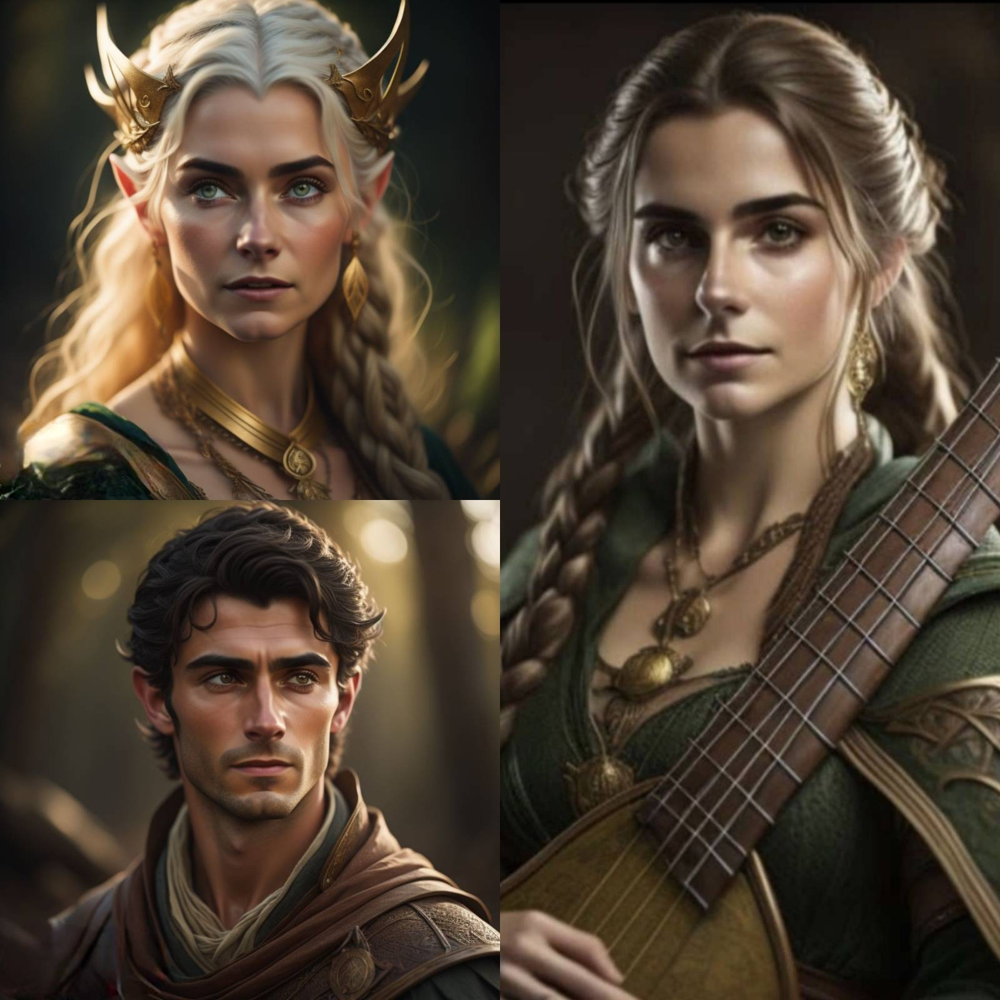
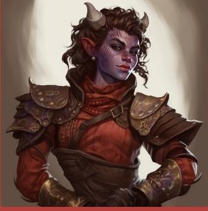
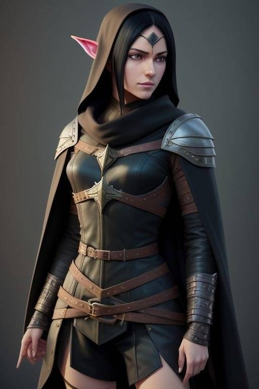
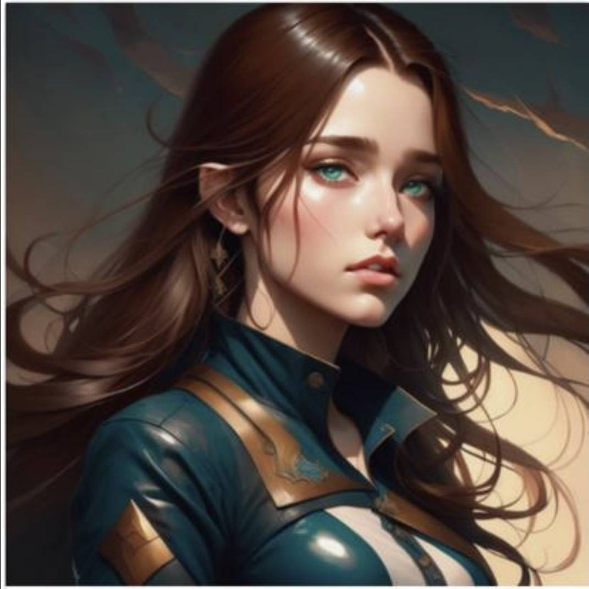
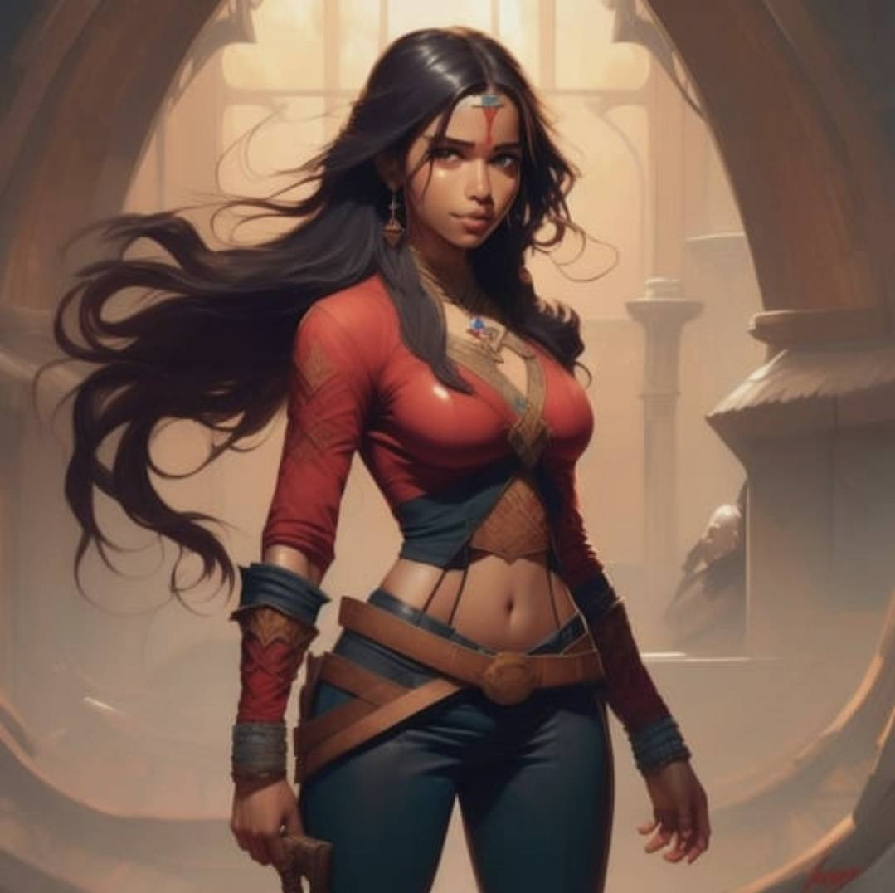
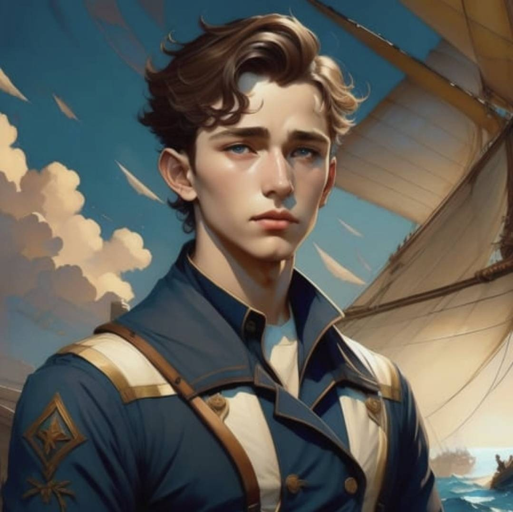
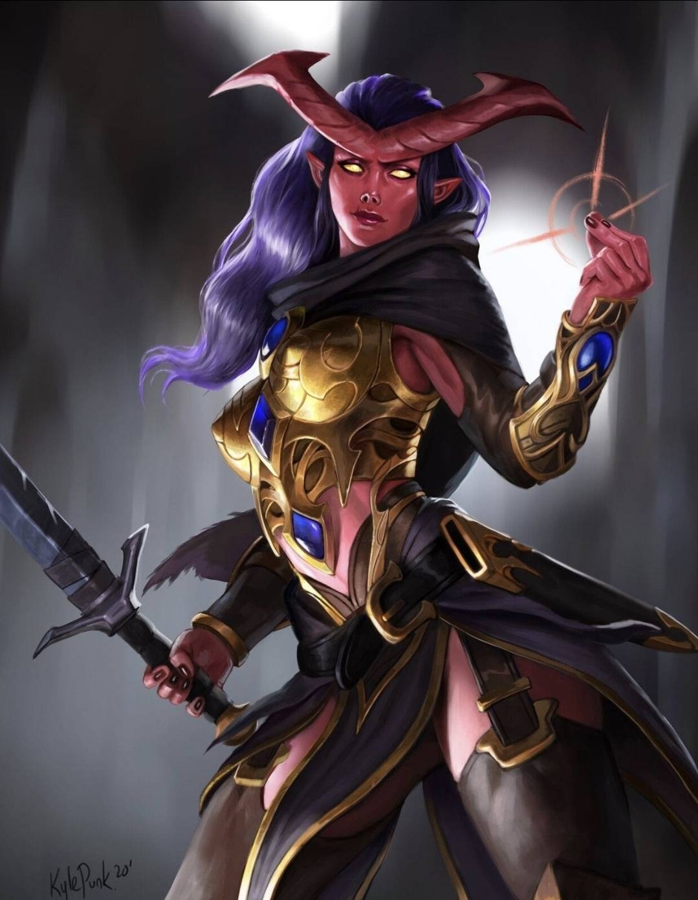

<!-- TOC -->
* [<u>**Summaries**</u>](#usummariesu)
  * [<u>**Characters**</u>](#ucharactersu)
    * [<u>*Jessy and parents*</u>](#ujessy-and-parentsu)
    * [<u>*Pip*</u>](#upipu)
    * [<u>*Renfri*</u>](#urenfriu)
    * [<u>*Lia*</u>](#uliau)
    * [<u>*Inara*</u>](#uinarau)
    * [<u>*Joshua*</u>](#ujoshuau)
    * [<u>*Akra*</u>](#uakrau)
  * [<u>**Session 1**</u>](#usession-1u)
<!-- TOC -->

# **J's DnD Seshes**
## <u>**1.0 Characters**</u>
### *1.1 Jessy and parents*

### *1.2 Pip*

### *1.3 Renfri*

### *1.4 Lia*

### *1.5 Inara*

### *1.6 Joshua*

### *1.7 Akra*

## <u>**2.0 Summaries**</u>
### 2.1 Session 1
Ok, I can't find a summary of session 1, so I'll give you a quick rundown of what I remember. So in the city of Mythrandir, on the continent of Terra, a team are being assembled by Akra, a teifling fighter and leader of the Slayers Take (a group that procures rare things for profit). Jessi (me) posing as a human bard is there just for the adventure and song inspo, Lia a human fighter, Pip a teifing rouge and Renfri a half elf rouge. Akra tasks us with bringing back basilisk fangs from Strom Wreck Isle and can collect info from a sorceress called Inara. So we get a boat over with Joshua, and we get attacked by Sahuagine. Lia manages to kill them, while I'm just being a pain in the ass and singing at the back. We make it over to Storm Wreck Isle. While travelling through the woods to the town of Dragons Rest, 2 zombies come upon us. Renfri and Pip fuck off somewhere into the trees leaving me and Lia to fight them, but I enchant one to flail around in the other direction drawing the others attention. Because I was concentrating on the spell, my disguise hiding my elven half slipped, and Lia saw, but never said anything. We make  it to town, everyone's on edge. We find a temole showing that they worship the dragon Runara. We meet Inara there, and she tells us where we can find basilisks, but also tasks us with finding out about why the island is plagued with zombies. We head to the pub for the night. I perfor,  and the team gets to know each other a little.

#### 2.1.1 Song
Song for for 1st mission:

In the land of Mythrandir, a grand adventure begins, a mission from the Slayers Take, one they're determined to win.
Lia the warrior, fierce as fire within.
Pip, the tricky tiefling rogue, quick and sly.
Renfri, the half-elf rogue, secrets in her eye.

Joined by Jessi, the bard with a melody so sweet,
Together they set sail to a land so neat.
Across the sea to Storm Wreck Isle they steer,
Their hearts filled with hope, dispelling all fear.

Oh, they're the Cross Swords, a band so brave,
Facing danger head-on, their spirits never wane.
Unyielding in their quest, they'll battle all foes,
And in the end, they'll be hailed as heroes.

Upon their voyage, the sea churns and roars,
As they battle the Sahuaugine, those sea-dwelling horrors.
With swords and spells, they fight side by side,
United in purpose, their courage can't hide.

Arriving at Dragons Rest, an ancient land of lore,
Skeletons and zombies rise, an undead galore.
But the Cross Swords stand strong, their will unshakeable,
With their blades gleaming bright, they remain unstoppable.

With hearts ablaze, they descend into the depths,
Facing basilisks, the guardians they must best.
Through perilous darkness, they navigate,
Their unity and strength the darkness can't abate.

Oh, they're the Cross Swords, a band so brave,
Facing danger head-on, their spirits never wane.
Unyielding in their quest, they'll battle all foes,
And in the end, they'll be hailed as heroes.

Emerging triumphant from the deepest abyss,
The Cross Swords are hailed, the tale of their prowess.
Heroes of Dragon Rest, their fame spreads wide,
The saviors of darkness, with hearts unified.

With heads held high, their victory they claim,
Forever remembered, immortalized in name.
Lia, Pip, Renfri, and Jessi, a fellowship true,
The Cross Swords, a symbol of courage anew.

Oh, they're the Cross Swords, a band so brave,
Facing danger head-on, their spirits never wane.
Unyielding in their quest, they'll battle all foes,
And in the end, they'll be hailed as heroes.

Dragons Rest sings of their valor and might,
The Cross Swords forever shining in the light.
Their journey may end, but their legacy remains,
A testament to friendship, overcoming all pains.

### 2.2 Session 2
The party set off from The Dragon's Rest towards the observatory to investigate the source of the undead and to find the missing sorcerer, Jensen. Whilst moving through the woods, Lia hears the sound of Zombies approaching. 3 Zombies attack the party who choose to stay and fight, managing to defeat them. A hoard then arrives on the horizon but the party is saved by Runara, the Bronze Dragon who resides on Stormwreck Isle. Runara thanks the party for attempting to restore the natural order and protects them on their way to the observatory. Once there the party are set upon by several skeletons. Pip and Renfri take these out by using their rogue stealth and acrobatics. The party then make their way up the observatory tower and come across Jensen's quarters where they find a broken mirror with Elvish inscriptions that Renfri is able to decipher. On the top floor of the observatory, the party encounter 3 skeletons, a now dead and shackled Zombie Jensen and a mysterious hooded figure in black robes chanting a spell in Elvish, Infernal and (what Inara later identifies as) Deep Speech. The figure hears the party and vanishes, leaving behind a pulsating, glowing purple orb. The party make quick work of the skeletons and Pip and Lia investigate the orb. Jessy, having missed all her previous attacks against the skeletons, fires the killing blow to take out Jensen. Both Lia and Jessy work together to destroy the orb and the spell over the Isle is broken. The party retires to Jensen's old quarters in the observatory tower and Renfri discovers his diary in a hidden drawer.

#### 2.2.1 Song
Each session I generate and perform a wee song ?

(Verse 1)
In the darkest caverns, where shadows dance,
I wield my sword, but I don't stand a chance,
The skeletons rise, their bones so fierce,
But I fumble with fear, my attacks so mere.

(Pre-Chorus)
I stumble and I stumble, my skills are so weak,
I swing and I miss, this battle seems bleak,
But deep down inside, I know that there's hope,
To conquer my fears, to learn how to cope.

(Chorus)
I'm rubbish at killing skeletons, it's plain to see,
But I won't give up on this destiny,
I'll practice with purpose, I'm learning to fight,
One day I'll prevail, in the darkness, bring light.

(Verse 2)
With each failed attempt, I grow stronger still,
I study their movements, their patterns, their skill,
I train in the moonlight, honing my blade,
Though my progress is slow, I won't be afraid.

(Pre-Chorus)
I stumble and I stumble, my skills are so weak,
I swing and I miss, this battle seems bleak,
But deep down inside, I know that there's hope,
To conquer my fears, to learn how to cope.

(Chorus)
I'm rubbish at killing skeletons, it's plain to see,
But I won't give up on this
This message has been generated by Nova - download it for free:
https://novaappai.page.link/B15EeyQe7cr89FsD8

### 2.3 Session 3
The party stay the night in Jensen's quarters in the observatory. During that time they eat food and read the pages of Jensen's diary which reveals a member of the council of Mythrandir has been visiting the island. In the morning, they ask Inara about the potions which she identifies to be the Good Hope, Haste and Sanctuary potions. When asked about the council member, she says she has an idea but doesn't reveal anything until Renfri presses her for more information later on. She then reveals to Renfri that she is suspicious of Vespera Shadowmire, her old mentor, who she knows has been leaving on various research missions. She vows to confront her on her return to Mythrandir. The party then enter the caves under the observatory and battle two basilisks, working together using the shards of Jensen's mirror to defeat the basilisks with ease. Pip and Renfri deal the final blows. On exiting the caves, Jessy's true identity is revealed: she is in fact a half-elf, not a human and is 92 years old. Whilst Pip and Lia are forgiving of Jessy, Renfri keeps her distance. The party returns to the celebrating town of Dragon's Rest and are given free drinks by the bartender Greg who asks them what they call themselves. At the moment: The Cross Swords.

### 2.4 Session 4
The party is awoken by the sound of bells and witnesses the town of Dragon's Rest reburying their dead and mourning the loss of Jensen. The party then waits for Inara in the library and return as a group to Mythrandir where they receive their bounty. Inara gives them a map of the city and says she will be back in touch. The party explore the city. They first enter The Crimson Sash clothing store and meet an elderly gnome called Lilli Nim who repairs their tattered clothes and designs their outfits with the Cross Swords symbol. The party then split up to explore further. Renfri, with the goal to steal from the rich, tries to enter the Inner Sanctum through the main gate but it is guarded. Instead she enters the Temple of Bahamut but decides that this is not the place to steal and joins Lia in the Magic Shop, Jinx and Trinkets. Lia, with the goal to improve her magic abilities, meets Kribi Mirlon, the Magic Shop owner, who creates a perception potion for her. Both go to join Pip and Jessy at the weapons shop: Tintagel Weapon Shop. Pip and Jessy meet Merlin and his apprentice Arthur and receive new weapons and upgrades to their armour. Renfri also receives an upgrade when she arrives. The party then go to The Green Dragon pub where Jessy performs for the crowd. Pip notices the symbol of The Swallow Thieves Guild and enters the secret underground lair where she encounters an old friend of her father: the leader of The Swallows, a half-orc named Baku. Armed with new illicit trinkets, she returns to the group and a very suspicious Renfri. The party rest for the night and return to The Slayer's Take where there is a notice from the local farmer asking for help to kill an Ankheg in exchange for 10 Gold and a horse and cart. Akra approaches Jessy and reveals that a high level political client has offered a large amount of money for the theft of the silver dragon egg in the study of Soros Davino, the leader of the Myrandir Council.

